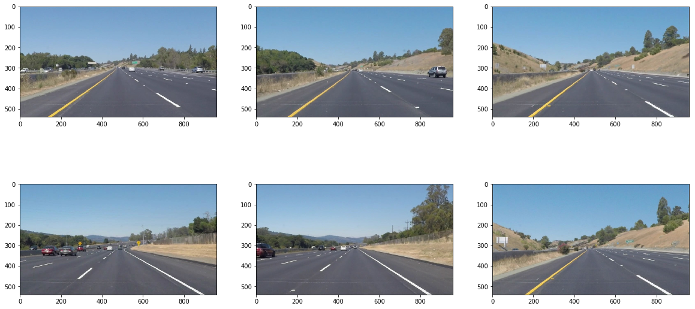
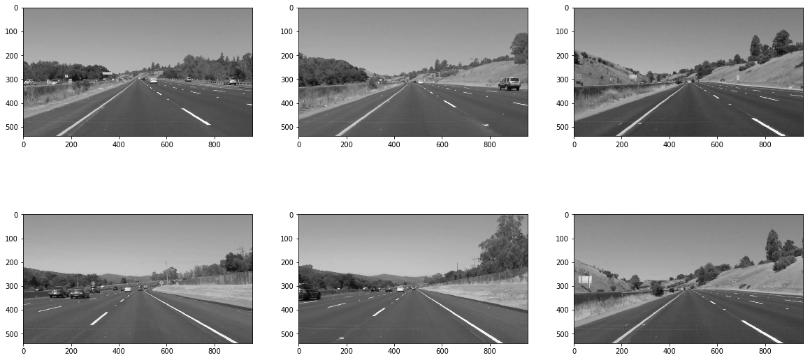
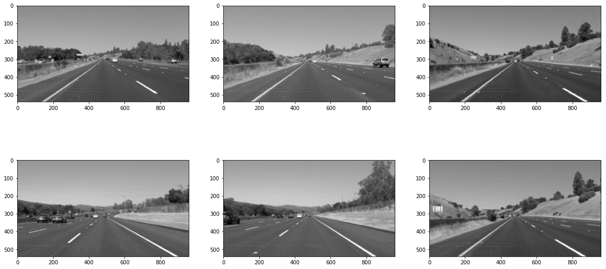
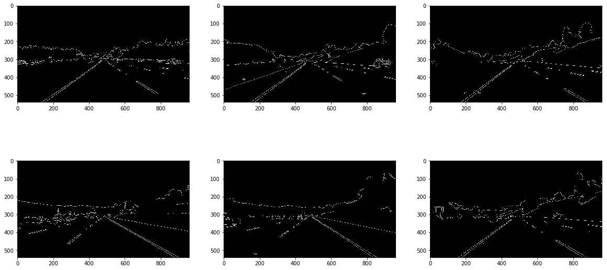
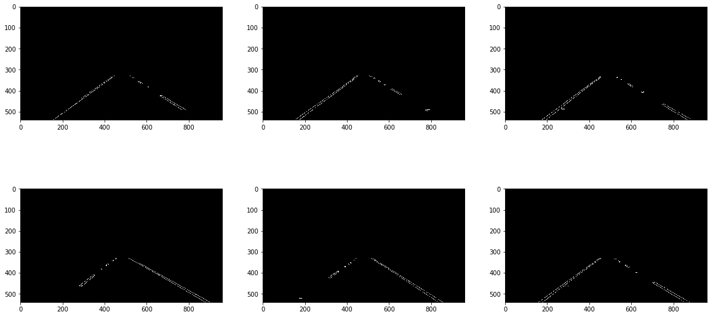
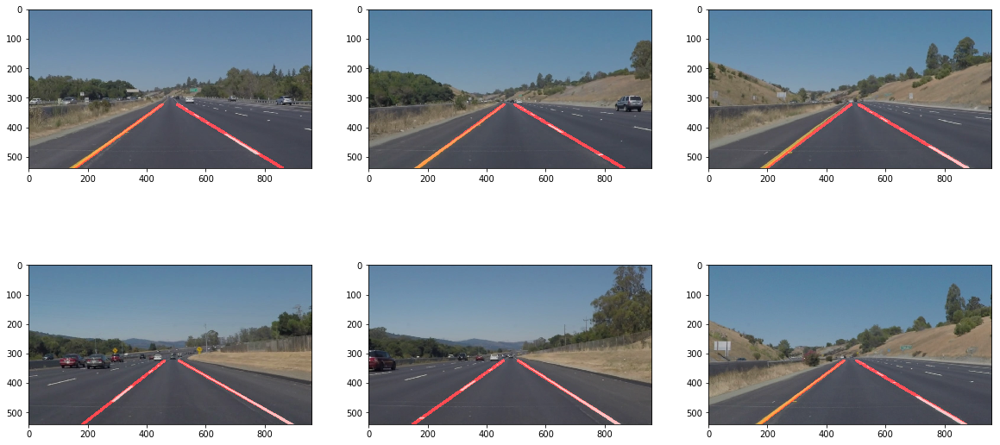
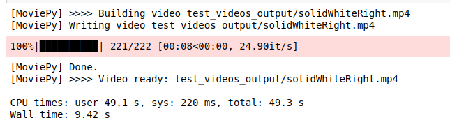
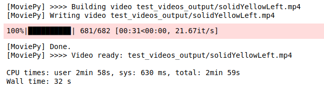

# **Finding Lane Lines on the Road** 


**Finding Lane Lines on the Road**

In the project, I use python and OpenCV to implement lane lines detection application. In order to achieve the goal, several technologies are used: 

    1. Gray Scaling
    2. Gaussian Blur
    3. Candy Edge Detection
    4. Region of interest
    5. Hough Transform
  
I succesfully implement the technologies to process images and video clip to find lane lines.
    


[Video Link](https://youtu.be/wZZ1Hnqxh9g)
[Video Link](https://youtu.be/MYRgzR4qH7E)

---

Load test images from examples folder:



The test images contain yellow lane line and white lane line. My image processing will have three main stages pipeline: 
    1. Candy Edge Detection
    2. Region of interest
    3. Hough Transform on Lane Detection
   

## Candy Edge Detection

In the project, Candy edge Detection is used for finding lane lines. There are several steps for achieving the purpose:

    1. Gray Scaling
    2. Gaussian Blur
    3. Edge Detection

### Gray Scaling

The reason why we use gray scaling is that greyscale image is one in which the value of each pixel is a single sample representing only an amount of light from Wikipedia. Normally the white and bright yellow lines or segment have large 8 bit value in pixel compared with other objects whose color is darker. 

```python
def grayscale(img):
    return cv2.cvtColor(img, cv2.COLOR_RGB2GRAY)
```


### Gaussian Blur
By using Gaussian blur before Candy edge detection, the noise and spurious gradients will be suppressing. the Kernal size only can be selected as odd number. larger number smoothing over a larger area. 

```python
def gaussian_blur(img, kernel_size):
    """Applies a Gaussian Noise kernel"""
    return cv2.GaussianBlur(img, (kernel_size, kernel_size), 0)
```



### Edge Detection
There are two key parameters for Candy edge Detection in OpenCV: low threshold and high threshold. Candy edge Detection function is:cv2.Canny(img, low_threshold, high_threshold) .
At the Candy algorithm, the strong edge pixel above the high threshold will be detected, and pixels below low threshold will be rejected. What's more, pixels with values between low threshold and high threshold will be included. 
Also for ratio of low threshold to high threshold, John Canny recommmend the ratio is 1:2 to 1:3. 
So in the project I set low threshold is 50 and high threshold is 150.

```python
def canny(img, low_threshold, high_threshold):
    """Applies the Canny transform"""
    return cv2.Canny(img, low_threshold, high_threshold)
```



## Region of Interest
From Candy edge detection, we can easily see that apart from lane lines, there are other edges detected in image, which are useless,even harmful for lane detection. So the method deal with those edges is that we can mask the irrelavant edges and only focus on lane line edges.

```python
def region_of_interest(img, vertices):

    #defining a blank mask to start with
    mask = np.zeros_like(img)   
    
    #defining a 3 channel or 1 channel color to fill the mask with depending on the input image
    if len(img.shape) > 2:
        channel_count = img.shape[2]  # i.e. 3 or 4 depending on your image
        ignore_mask_color = (255,) * channel_count
    else:
        ignore_mask_color = 255
        
    #filling pixels inside the polygon defined by "vertices" with the fill color    
    cv2.fillPoly(mask, vertices, ignore_mask_color)
    
    #returning the image only where mask pixels are nonzero
    masked_image = cv2.bitwise_and(img, mask)
    return masked_image


imshape = image.shape
vertices = np.array([[(imshape[1]*0.15,imshape[0]),(440, 330), (520, 330), (imshape[1]*0.95,imshape[0])]], dtype=np.int32)
```




## Hough Transform on Lane Detection
In the project, we are using Hough Transform function from OpenCV:
lines = cv2.HoughLinesP(img, rho, theta, threshold, np.array([]), minLineLength=min_line_len, maxLineGap=max_line_gap)

There are several parameter need to be set for detecting lanes:
    1. rho and theta are the distance and angular resolution in Huogh space.
    2.threshold means the minimum number of intersections in a given image.
    3.min line length is the minimum length of a line that will be accepted in ouput.
    4. max line gap is the maximum distance between segments that will be connected to be a single line.
    
```python
def hough_lines(img, rho, theta, threshold, min_line_len, max_line_gap):
  
    lines = cv2.HoughLinesP(img, rho, theta, threshold, np.array([]), minLineLength=min_line_len, maxLineGap=max_line_gap)
    
    return lines

```

From Hough_lines function, Detected lines' segments information. we need to extract slope and intercept from the information. Then average the all of slope and intercept to get a average values. Using the average values extroplate a guide lane.
slope can be got using (y2 - y1) / (x2 - x1) .
intercept is y2 - slope * x2
The solution for average slope and intercept is that length of lines will be calculated, the length will be regards as a weight for average slope and intercept, in other word, the longer lines will have more power to impact the average slope and intercept. By taking advantage of the method, some of short lines from noise can be suppressed.
Once average slope and intercept are available, we can just extrapolate lines.

```python
def average_lines(lines):
    
    left_slope_intercept = []  # (slope, intercept)
    left_weight = [] 
    
    right_slope_intercept = []
    right_weight = []
    
    #average
    for line in lines:
        for x1,y1,x2,y2 in line:
            slope = (y2 - y1) / (x2 - x1)
            intercept = y2 - slope * x2
            length = np.sqrt((y2-y1)**2 + (x2-x1)**2)
            if slope > 0:
                left_slope_intercept.append([slope,intercept])
                left_weight.append(length)
            else:
                #print (lines)
                #print (slope)
                right_slope_intercept.append([slope,intercept])
                right_weight.append(length)
                
    #print(left_slope_intercept)
    #print(left_weight)
    
    left_lane = np.dot(left_weight,left_slope_intercept)/np.sum(left_weight) if len(left_weight)>0 else None
    right_lane = np.dot(right_weight, right_slope_intercept)/np.sum(right_weight) if len(right_weight)>0 else None
    #print (np.sum(right_weight))
    #print (right_slope_intercept)
    
    return left_lane,right_lane


def extrapolate_lines(height, lane):
    
    if lane is None: return None
    
    #print(lane)
    
    y1 = int(height)
    y2 = int(height * 0.6)
    x1 = int((y1 - lane[1])/lane[0])
    x2 = int((y2 - lane[1])/lane[0])
    
    
    
    return [x1,y1,x2,y2]

```

So draw_lines function will contain average and extraplate function and hough lines will return guide lanes


```python
def draw_lines(img, lines, color=[255, 0, 0], thickness=9):
    
    left_slope_intercept = []  # (slope, intercept)
    left_weight = [] 
    
    right_slope_intercept = []
    right_weight = []
    
    
    left_lane, right_lane = average_lines(lines)
    ex_left_lane = extrapolate_lines(image.shape[0],left_lane)
    ex_right_lane = extrapolate_lines(image.shape[0],right_lane)
    
    if ex_left_lane is not None:
        x1,y1,x2,y2 = ex_left_lane
        cv2.line(img, (x1, y1), (x2, y2), color, thickness)
     
    if ex_right_lane is not None:
        x1,y1,x2,y2 = ex_right_lane
        cv2.line(img, (x1, y1), (x2, y2), color, thickness)

def hough_lines(img, rho, theta, threshold, min_line_len, max_line_gap):
    """
    `img` should be the output of a Canny transform.
        
    Returns an image with hough lines drawn.
    """
    lines = cv2.HoughLinesP(img, rho, theta, threshold, np.array([]), minLineLength=min_line_len, maxLineGap=max_line_gap)
    line_img = np.zeros((img.shape[0], img.shape[1], 3), dtype=np.uint8)
    draw_lines(line_img, lines)
    return line_img

def weighted_img(img, initial_img, α=0.8, β=1., γ=0.):
    """
    `img` is the output of the hough_lines(), An image with lines drawn on it.
    Should be a blank image (all black) with lines drawn on it.
    
    `initial_img` should be the image before any processing.
    
    The result image is computed as follows:
    
    initial_img * α + img * β + γ
    NOTE: initial_img and img must be the same shape!
    """
    return cv2.addWeighted(initial_img, α, img, β, γ)

```

The below function image_pipeline is image processing pipeline for lane detection.


```python
def average_lines(lines):
    
    left_slope_intercept = []  # (slope, intercept)
    left_weight = [] 
    
    right_slope_intercept = []
    right_weight = []
    
    #average
    for line in lines:
        for x1,y1,x2,y2 in line:
            slope = (y2 - y1) / (x2 - x1)
            intercept = y2 - slope * x2
            length = np.sqrt((y2-y1)**2 + (x2-x1)**2)
            if slope > 0:
                left_slope_intercept.append([slope,intercept])
                left_weight.append(length)
            else:
                #print (lines)
                #print (slope)
                right_slope_intercept.append([slope,intercept])
                right_weight.append(length)
                
    #print(left_slope_intercept)
    #print(left_weight)
    
    left_lane = np.dot(left_weight,left_slope_intercept)/np.sum(left_weight) if len(left_weight)>0 else None
    right_lane = np.dot(right_weight, right_slope_intercept)/np.sum(right_weight) if len(right_weight)>0 else None
    #print (np.sum(right_weight))
    #print (right_slope_intercept)
    
    return left_lane,right_lane


def extrapolate_lines(height, lane):
    
    if lane is None: return None
    
    #print(lane)
    
    y1 = int(height)
    y2 = int(height * 0.6)
    x1 = int((y1 - lane[1])/lane[0])
    x2 = int((y2 - lane[1])/lane[0])
    
    
    
    return [x1,y1,x2,y2]

```

So draw_lines function will contain average and extraplate function and hough lines will return guide lanes


```python
def image_pipeline(image):
    
    gray = grayscale (image)

    # Define a kernel size and apply Gaussian smoothing
    kernel_size = 5
    blur_gray = gaussian_blur(gray,kernel_size)

    # Define our parameters for Canny and apply
    low_threshold = 50
    high_threshold = 150
    edges = canny(blur_gray, low_threshold, high_threshold)
    #print (edges)

    # Define a region we are interested in
    imshape = image.shape
    vertices = np.array([[(imshape[1]*0.15,imshape[0]),(440, 330), (520, 330), (imshape[1]*0.95,imshape[0])]], dtype=np.int32)
    masked_edges = region_of_interest(edges, vertices)
    test_edges = region_of_interest(image, vertices)
    #plt.imshow (test_edges)
    #plt.imshow(masked_edges,cmap='gray')


    # Define the Hough transform parameters
    rho = 2
    theta = np.pi/180
    threshold = 20
    min_line_len = 20
    max_line_gap = 300

    # Run Hough on edge detected image
    line_image = hough_lines(masked_edges, rho, theta, threshold, min_line_len, max_line_gap)


    # Create a "color" binary image to combine with line image
    color_edges = np.dstack((edges, edges, edges))

    # Draw the lines on the edge image

    #lines_edges = weighted_img(color_edges, line_image) 
    lane_image = weighted_img(line_image, image)
    
    return lane_image

```




## Test on video clips

Import everything needed to edit/save/watch video clips

```python
from moviepy.editor import VideoFileClip
from IPython.display import HTML
```
Test image processing pipeline for right white lanes video clip

```python
white_output = 'test_videos_output/solidWhiteRight.mp4'
clip1 = VideoFileClip("test_videos/solidWhiteRight.mp4")#.subclip(0,5)
white_clip = clip1.fl_image(image_pipeline) #NOTE: this function expects color images!!
%time white_clip.write_videofile(white_output, audio=False)
```



[Right White Lane Detection] (https://youtu.be/wZZ1Hnqxh9g)


Test image processing pipeline for right white lanes video clip

```python
yellow_output = 'test_videos_output/solidYellowLeft.mp4'
clip2 = VideoFileClip('test_videos/solidYellowLeft.mp4')
yellow_clip = clip2.fl_image(image_pipeline)
%time yellow_clip.write_videofile(yellow_output, audio=False)
```


[Left Yellow Lane Detection] (https://youtu.be/MYRgzR4qH7E)


## Identify potential shortcomings with your current pipeline


1. My current pipeline can not handle the challenge video clip.The resason is that because challenge video have a scenario that trees will shadow the yellow lane line and also trees also will cause some noise for edge detection.
2. The algorithm probably have a difficulty on sharp curve lines.
3. Region of interst is set manually.


## Suggest possible improvements to your pipeline

1.Implement color filter to mask other objects and only remain yellow lane and white lane lines.
2.For sharp curve lines, we need to use other ways to average and extrapolate lines. 
3.Automatically set region of interest.
